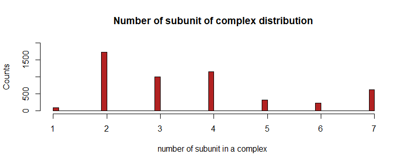
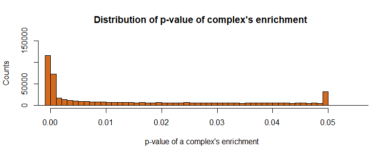
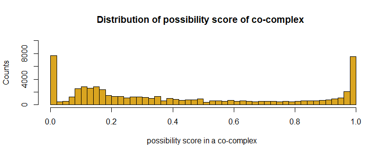
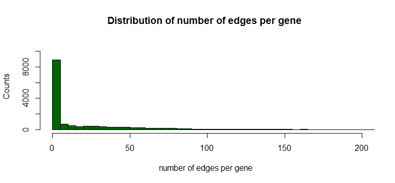
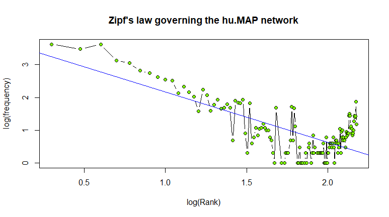
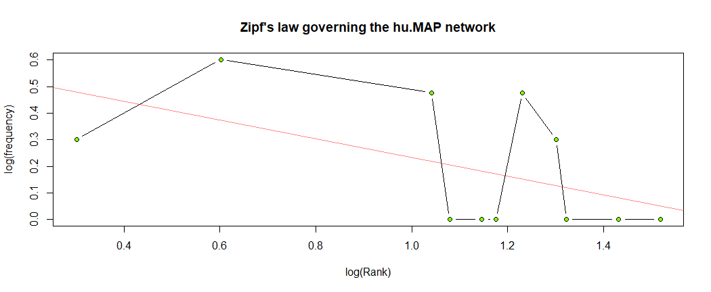
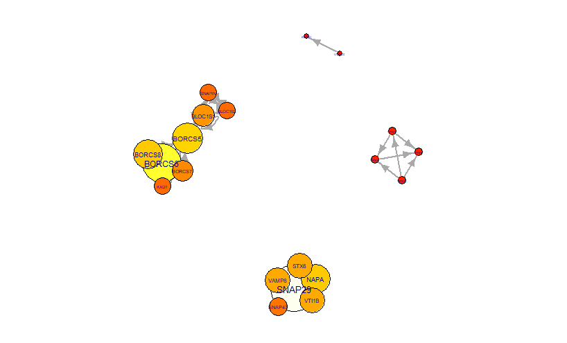

# `BCB420.2019.hu.MAP`


###### [Yin Yin](https://orcid.org/0000-0001-9168-488X), University of Toronto, Canada. &lt;yin.yin@mail.utoronto.ca&gt;
## 1 About this package:
This package describes the workflow to utilize human protein complex data from the hu.MAP. The workflow demonstrates how to check if HGNC symbols inside database is latest, how to annotate the example gene set, and also provides examples of computing database statistics.

The package serves dual duty, as an RStudio project, as well as an R package that can be installed. Package checks pass without errors, warnings, or notes.
#### In this project...

## 2 hu.MAP Data
hu.MAP refers to Human Protein Complex Map which attempts to address the lack of understanding of protein complex in human. This database combines serveral large scale protein interaction datasets to get most comprehensive understanding of human protein complexes. Protein inteaction network shows co-compelx potein pairs that are observed in protein complex map with corresponding probability score.The enrichments data and edge data are also included in the additional files of hu.MAP. 

This main document describes work with [Protein Interaction Network with probability scores (genenames)](http://proteincomplexes.org/download) [Drew, Kevin, et al. ](http://msb.embopress.org/content/13/6/932)

You may also need to download additional file: Enrichment table and Edge table.
#### 2.1 Data semantics

<br /> This data integrated three protein interaction networks, BioPlex, Hein et al, and Wan et al into an combined protein complex network and clustered to identify protein complexes through the synthesis of over 9,000 published mass spectrometry experiment. Parameters for the SVM and clustering algorithms were optimized on a training set of literature‐curated complexes and validated on a test set of complexes.
## 3 Data download and cleanup
To download this package related hu.MAP data:
1. Navigate to the [hu.MAP database download page](http://proteincomplexes.org/download)
2. Click following files to download:
Protein Interaction Network with probability scores (genenames)
Enrichment table
Edge table
3. Place them in the same directory.
## 4 Mapping Entrez IDs to HGNC symbols
2. Click following files to download:
<br />Protein Complex Map
```txt
# Example
# Each line represent a complex and the listed genes() are composed 
153129 10670 64121
441502 3024
2648 26009 10474 57325 8850 55689 6871
3189 144983

```
<br />Protein Complex Map (genenames)
```txt
# Example
# Each line represent a complex and the listed genes(HGNC symbols) are composed 
SLC38A9	RRAGA	RRAGC
441502	HIST1H1A
KAT2A	ZZZ3	TADA3	KAT14	KAT2B	YEATS2	TADA2A
HNRNPH3	HNRNPA1L2

```
<br />Protein Interaction Network with probability scores
```txt
# Example
# Each line represent a co-protein (Entrez IDs) complex with the corresponding svm probability score 
996	64682	1.0
9861	5706	1.0
9861	5700	1.0
9774	9967	1.0
```
<br />Protein Interaction Network with probability scores (genenames)
```txt
# Example
# Each line represent a co-protein (HGNC symbols) complex with the corresponding svm probability score 
9YEATS4	VPS72	1.0
STON2	AP2M1	1.0
SRSF9	SRSF1	1.0
SNRPA1	SNRPD1	1.0
```
<br />Node table
```
# Example
acc,clustid,clustid_key,genename,key,proteinname,uniprot_link
Q8NBW4,0,0_153129,SLC38A9,153129,"Sodium-coupled neutral amino acid transporter 9 (Solute carrier family 38 member 9) (Up-regulated in lung cancer 11)
",http://www.uniprot.org/uniprot/Q8NBW4
Q7L523,0,0_10670,RRAGA,10670,"Ras-related GTP-binding protein A (Rag A) (RagA) (Adenovirus E3 14.7 kDa-interacting protein 1) (FIP-1)
",http://www.uniprot.org/uniprot/Q7L523
```
<br />Enrichment table
```txt
# Example
# Output from gprofiler for each complex, FDR-corrected hypergeometric p <= 0.05
complex_id	corr_pval	t_count	q_count	qandt_count	qandt_by_q	qandt_by_t	term_id	t_type	t_group	t_name	depth_in_group	qandt_list
0	1.60e-08	24	3	3	1.000	0.125	GO:0071230	BP	1	cellular response to amino acid stimulus	1	Q9HB90,Q7L523,Q8NBW4
0	1.82e-08	25	3	3	1.000	0.120	GO:0032008	BP	1	positive regulation of TOR signaling	1	Q9HB90,Q7L523,Q8NBW4
0	2.31e-08	27	3	3	1.000	0.111	GO:0043200	BP	1	response to amino acid	1	Q9HB90,Q7L523,Q8NBW4
```
<br />Edge table
```txt
# Example
# List of edges in the complex map with svm probability score and boolean values for each evidence type determining support for the edge
# Complex_id is made of complex number and gene ids
complex_id	corr_pval	t_count	q_count	qandt_count	qandt_by_q	qandt_by_t	term_id	t_type	t_group	t_name	depth_in_group	qandt_list
id1	score	fractions	bioplex	hein	bioplex_prey	hein_prey
0_153129 (pp) 0_10670	0.6968840000000001	False	True	False	True	False
0_153129 (pp) 0_64121	0.5299699999999999	False	False	False	True	False
0_10670 (pp) 0_64121	0.9627049999999999	False	True	False	True	False
```
3. Place them in the same directory.
## 4 Update HGNC symbols
hu.Map's data has two versions. One version uses Entrez ID and another version uses gene symbol. Although this database came out only at 2017 and the possibility that HGNC symbols update is small, the version of using gene symbol maybe out-dated in the future. Therefore, we provide a way to check and update HGNC symbols.

Preparation:
BioMart

### 4.1 Import all data into R
   ```R
   # For all data file 
   
   tmp_genename <- read.table(filepath,
                          sep  ='\t',
                         fill=TRUE,stringsAsFactors = FALSE)
   # For enrichment data, node data and edge data, we need to delete first line which is colname in original file
   tmp_genename <- tmp_genename[2:nrow(tmp_genename),]
   ```

### 4.2 Update HGNC symbol 
&nbsp;

```R 
  # Fetch HGNC from github
  myURL <- paste0("https://github.com/hyginn/",
                "BCB420-2019-resources/blob/master/HGNC.RData?raw=true")
  load(url(myURL))
  # Use bioMart to map Entrez to HGNC symbols
  
  myMart <- biomaRt::useMart("ensembl", dataset="hsapiens_gene_ensembl")

  dbIDs <- biomaRt::getBM(attributes=c('entrezgene','hgnc_symbol'),mart = ensembl)

  # Check if genenames in the file is the same as in dbIDS
 sej <- matrix( ncol = 3)
 for (i in 1:20){
           for (n in 1:ncol(normal_genename)){
                   if (!((normal_genename[i,n]) %in% HGNC$sym) & nchar(sub('\\.[0-9]+', '', normal_genename[i,n])) != 0){ sej <- rbind(sej,c(toString(normal_genename[i,n]),  i,n))}
                   
          }}
  #Delete first line that only contain NA
  sej <- sej[2:nrow(sej),]
  ```
  Now, we face serveral conditions for changing unsame genenames to latest genenames
  1) The unsame symbols are in either HGNC$prev or HGNC$synonym.
  We update in file
  2) The unsame symbols are gene IDs
   We update in file
  3) The unsame symbols are Ensmbol IDs
  ``` 
   
 for (i in 1:nrow(sej)) {
    #The unsame symbols are in either HGNC$prev or HGNC$synonym.
    iPrev <- grep(sej[i, 1], HGNC$prev)[1] # take No. 1 if there are several
    if (!is.na(iPrev)) {
        row <- as.numeric(sej[i, 2])
        col <- as.numeric(sej[i,3])
        tmp_genename[row,col] <- HGNC$sym[iPrev]
        sej[i,1] <- "changed"
    } else {
        iSynonym <- grep(sej[i, 1], HGNC$synonym)[1]
        if (!is.na(iSynonym)) {
            row <- as.numeric(sej[i,2])
            col <- as.numeric(sej[i,3])
            tmp_genename[row, col] <- HGNC$sym[iSynonym]
            sej[i,1] <- "changed"
        }else {
            #The unsame symbols are gene IDS
            iGeneids <- grep(sej[i, 1], HGNC$GeneID)[1]
            if (!is.na(iGeneids)) {
                row <- as.numeric(sej[i, 2])
                col <- as.numeric(sej[i, 3])
                tmp_genename[row, col] <- HGNC$sym[iGeneids]
                sej[i, 1] <- "changed"
            } else {
                #The unsame symbols are ensembl ID
                iEnsids <- grep(sej[i, 1], HGNC$EnsID)[1]
                if (!is.na(iEnsids)) {
                    row <- as.numeric(sej[i, 2])
                    col <- as.numeric(sej[i, 3])
                    tmp_genename[row, col] <- HGNC$sym[iEnsids]
                    sej[i, 1] <- "changed"
                }            
            }
        }}}
```
Now, in ```sej``` we have left ids that cannot mapping to other known symbols. So, we will change them into NA.
```
for (i in 1:nrow(sej)) {
         if (!identical(sej[i,1], "changed")){row <- as.numeric(sej[i, 2])
        col <- as.numeric(sej[i, 3]) 
    dup_geno[row, col] <- NA}}
```
### 4.3 Create a mapping tool
The mapping tool is created for recording gene ID and corresbonding HGNC symbol and the complex number that gene belong to. We will also include edge information into it.
```
# The column number of each gene is the sum of 3 (gene ID and corresbonding HGNC symbol and the complex number) and 7 (information we want in the edge data)
# geneList can be get from analysis of network. It caclulate how many edges for each gene.
mapping_tool <- matrix("", sum(genelist[,2]), 10 )
geneMapping <- matrix("", 1, 3)
for (i in 1:nrow(normal)){
    for (n in 1:ncol(normal)){
        if (nchar(normal[i,n]) != 0){geneMapping <- rbind(geneMapping, c(normal[i,n], dup_geno[i,n], i,"","","","","","",""))}}
}
geneMapping <- geneMapping[2:nrow(geneMapping),]   

# Split complex information and gene id in each edge information 
edgeSplit <- matrix("", nrow(edge), 9 )
for (i in 1:nrow(edge)){
    firstID <- unlist(strsplit(edge[i,1],"_"))[2]
    secondID <- unlist(strsplit(edge[i,3],"_"))[2]
    complexNumber <- unlist(strsplit(edge[i,1],"_"))[1]
    edgeSplit[i,1] <- complexNumber
    edgeSplit[i,2] <- firstID
    edgeSplit[i,3] <- secondID
    for (m in 4:9){
        edgeSplit[i, m] <- edge[i, m]
    }
    }
# mapping geneID to gene symbols
r (i in 1:nrow(edgeSplit)){
    edgeSplit[i,2] <- geneMapping[which(edgeSplit[i,2] == geneMapping[,1])[1],2]
    edgeSplit[i,3] <- geneMapping[which(edgeSplit[i,3] == geneMapping[,1])[1],2]}

      
# Assign correct edge to each gene
 n <- 1
 
for (i in 1:nrow(geneList)){
    # Check if the gene exists in first ID and have same complex number
    location <- which(geneMapping[i,2] == edgeSplit[,2], geneMapping[i,3] == edgeSplit[,1])
    # Copy each edge information
    if (length(location) != 0) {
    for (m in 1:length(location)){
        for (t in 1:3){
            mapping_tool[n, t] <- geneMapping[i, t]
        }
        
       
            mapping_tool[n,4] <- edgeSplit[location[m], 3]
        
        for (t in 4:9){
            mapping_tool[n, t+1] <- edge[i, t]
        }
        n <- n + 1
    }}
    # Check if the gene exists in second ID and have same complex number
    location <- which(geneMapping[i,1] == edgeSplit[,3], geneMapping[i,3] == edgeSplit[,1])
    if (length(location) != 0) {
    for (m in 1:length(location)){
        for (t in 1:3){
            mapping_tool[n, t] <- geneMapping[i, t]
        }
        
            mapping_tool[n,4] <- edgeSplit[location[m], 2]
        
        for (t in 4:9){
            mapping_tool[n, t+1] <- edge[i, t]
        }
        n <- n + 1
    }}
}
       

```
### 4.3 Final validation

## 5 Annotation  gene set
First, we need to analyze our hu.MAP.

### 5.1 Complex statistics
We need to know how number of subunit of complex distribution

```
df <- matrix(0,nrow = nrow(dup_geno))

for (i in 1:nrow(dup_geno)){
          nSubunit <- 0
          n <- 1
          for (n in 1:ncol(dup_geno)){
                  if (is.na(dup_geno[i,n])){
                        nSubunit <- nSubunit + 1
             } else if (!nchar(dup_geno[i,n]) == 0){
                  nSubunit <- nSubunit + 1}
              df[i,1] <- nSubunit}
     }

hist(df[,1],
     ylim=c(0,2000), breaks = 50,col = "#B22222",
     main = "Number of subunit of complex distribution",
     xlab = "number of subunit in a complex ",
     ylab = "Counts")
```


We also want to the distribution of pvalue in enrichments of complex.

```
#Build a dataframe to contain all pvalue
df <- matrix(0,nrow(enrichment))

for (i in 1:nrow(enrichment)){
    if (!is.na(enrichment[i,2])){
         df[n,1] <- as.numeric(enrichment[i,2])
         n <- n + 1}}
hist(df[,1],xlim = c(0, 0.055),ylim = c(0, 150000),breaks = 150000
     ,col = "#D2691E",
     main = "Distribution of p-value of complex's enrichment  ",
     xlab = "p-value of a complex's enrichment ",
     ylab = "Counts")
```

### 5.2 Co-complex score statistics
We want to know the distribution of possibility score of all co-complex.
```
### score is the file containing co-complex possibility score which can be installed from "Protein Interaction Network with probability scores" in hu.MAP

hist(score[,3], ylim = c(0,10000), breaks = 40
     ,col = "#DAA520",
     main = "Distribution of possibility score of co-complex  ",
     xlab = "possibility score in a co-complex ",
     ylab = "Counts")
```

### 5.3 Network statistics
we want to the complexity of the intereaction in the  Network. First, we want to know how many edges there can be in one gene.

```
genelist <- matrix(0, nrow(enrichment),2)

genelist <- as.data.frame(genelist)
 n <- 1
 
 for (i in 1:nrow(edge)){
    firstID <- unlist(strsplit(edge[i,1],"_"))[2]
    if ( ! firstID %in% genelist[,1]){
        genelist[n,1] <- firstID
        genelist[n,2] <- 1
        
        n <- n + 1}
    else {
        location <- grep(firstID, genelist[,1])
        genelist[location,2] <- genelist[location,2] + 1}
    secondID <- unlist(strsplit(edge[i,3],"_"))[2]
    if ( ! secondID %in% genelist[,1]){
        genelist[n,1] <- secondID
        genelist[n,2] <- 1
        
        n <- n + 1}
    else {
        location <- grep(secondID, genelist[,1])
        genelist[location,2] <- genelist[location,2] + 1}
}
```


Now, we need to look at the netwrok property.

```
df <- matrix("",nrow(edge), 2)
df[,1] <- edge[,1]
df[,2] <- edge[,3]
graph <- igraph::graph_from_edgelist(df)
tmp <- igraph::degree(graph)
freqRank <- table(tmp)
x <- log10(as.numeric(names(freqRank)) + 1)
y <- log10(as.numeric(freqRank))

# Plot
plot(x, y,
type = "b",
pch = 21, bg = "#7FFF00",
xlab = "log(Rank)", ylab = "log(frequency)",
main = "Zipf's law governing the hu.MAP network"
)
# Add baseline
ab <- lm(y ~ x)
abline(ab, col = "#0000FF", lwd = 0.7)
```

### 5.4 Annotation gene set

```
# Copy the gene set from BCB420 project

exmSet <- c("AMBRA1", "ATG14", "ATP2A1", "ATP2A2", "ATP2A3", "BECN1", "BECN2",
          "BIRC6", "BLOC1S1", "BLOC1S2", "BORCS5", "BORCS6", "BORCS7",
          "BORCS8", "CACNA1A", "CALCOCO2", "CTTN", "DCTN1", "EPG5", "GABARAP",
          "GABARAPL1", "GABARAPL2", "HDAC6", "HSPB8", "INPP5E", "IRGM",
          "KXD1", "LAMP1", "LAMP2", "LAMP3", "LAMP5", "MAP1LC3A", "MAP1LC3B",
          "MAP1LC3C", "MGRN1", "MYO1C", "MYO6", "NAPA", "NSF", "OPTN",
          "OSBPL1A", "PI4K2A", "PIK3C3", "PLEKHM1", "PSEN1", "RAB20", "RAB21",
          "RAB29", "RAB34", "RAB39A", "RAB7A", "RAB7B", "RPTOR", "RUBCN",
          "RUBCNL", "SNAP29", "SNAP47", "SNAPIN", "SPG11", "STX17", "STX6",
          "SYT7", "TARDBP", "TFEB", "TGM2", "TIFA", "TMEM175", "TOM1",
          "TPCN1", "TPCN2", "TPPP", "TXNIP", "UVRAG", "VAMP3", "VAMP7",
          "VAMP8", "VAPA", "VPS11", "VPS16", "VPS18", "VPS33A", "VPS39",
          "VPS41", "VTI1B", "YKT6")
          

# which example genes are not among the known nodes?
x <- which( ! (exmSet %in% c(edgeSplit[,2], edgeSplit[,3])))
cat(sprintf("\t%s\t(%s)\n", HGNC[xSet[x], "sym"], HGNC[xSet[x], "name"]))

   #BECN2	(beclin 2)
 	#BIRC6	(baculoviral IAP repeat containing 6)
 	#CACNA1A	(calcium voltage-gated channel subunit alpha1 A)
 	#EPG5	(ectopic P-granules autophagy protein 5 homolog)
 	#INPP5E	(inositol polyphosphate-5-phosphatase E)
 	#IRGM	(immunity related GTPase M)
 	#LAMP2	(lysosomal associated membrane protein 2)
 	#LAMP3	(lysosomal associated membrane protein 3)
 	#LAMP5	(lysosomal associated membrane protein family member 5)
 	#MAP1LC3A	(microtubule associated protein 1 light chain 3 alpha)
 	#MAP1LC3B	(microtubule associated protein 1 light chain 3 beta)
 	#MAP1LC3C	(microtubule associated protein 1 light chain 3 gamma)
 	#NSF	(N-ethylmaleimide sensitive factor, vesicle fusing ATPase)
 	#PLEKHM1	(pleckstrin homology and RUN domain containing M1)
 	#RAB20	(RAB20, member RAS oncogene family)
 	#RAB21	(RAB21, member RAS oncogene family)
 	#RAB29	(RAB29, member RAS oncogene family)
 	#RAB39A	(RAB39A, member RAS oncogene family)
 	#RAB7B	(RAB7B, member RAS oncogene family)
 	#RUBCN	(rubicon autophagy regulator)
 	#RUBCNL	(rubicon like autophagy enhancer)
 	#SPG11	(SPG11, spatacsin vesicle trafficking associated)
 	#STX17	(syntaxin 17)
 	#SYT7	(synaptotagmin 7)
 	#TGM2	(transglutaminase 2)
 	#TIFA	(TRAF interacting protein with forkhead associated domain)
 	#TMEM175	(transmembrane protein 175)
 	#TPCN2	(two pore segment channel 2)
 	#TPPP	(tubulin polymerization promoting protein)
 	#VAMP7	(vesicle associated membrane protein 7)
 	#VPS39	(VPS39, HOPS complex subunit)
# Get example genes that are contained in our mapping.

firstCol <- which( mapping_tool[,2]  %in% intersect(mapping_tool[,4],exmSet) )
secondCol <- which( mapping_tool[,4]  %in% intersect(mapping_tool[,4],exmSet) )

# Overlapping is the location of example gene
exmEdgelistLocation <- intersect(firstCol,secondCol)
 exmEdgeList <- matrix("", length(exmEdgelistLocation),2)
 
 for (i in 1:length(exmEdgelistLocation)){
     exmEdgeList[i,1] <- mapping_tool[exmEdgelistLocation[i],2]
     exmEdgeList[i,2] <- mapping_tool[exmEdgelistLocation[i],4]}
     
 ```
### 5.5 Biological validation:network properties
```
graph <- igraph::graph_from_edgelist(exmEdgeList)
tmp <- igraph::degree(graph)
freqRank <- table(tmp)
x <- log10(as.numeric(names(freqRank)) + 1)
y <- log10(as.numeric(freqRank))

plot(x, y,
type = "b",
pch = 21, bg = "#7FFF00",
xlab = "log(Rank)", ylab = "log(frequency)",
main = "Zipf's law governing the hu.MAP network"
)
ab <- lm(y ~ x)
abline(ab, col = "#FF000077", lwd = 0.7)
```

```
# Get list of en highest degree
x <- sort(dg, decreasing = TRUE)[1:10]
cat(sprintf("\t%d:\t%s\t(%s)\n", x, names(x), HGNC[names(x), "name"]))

   #32:	SNAP29	(synaptosome associated protein 29)
 	#26:	BORCS6	(BLOC-1 related complex subunit 6)
 	#20:	BORCS5	(BLOC-1 related complex subunit 5)
 	#19:	BORCS8	(BLOC-1 related complex subunit 8)
 	#19:	NAPA	(NSF attachment protein alpha)
 	#16:	VAMP8	(vesicle associated membrane protein 8)
 	#16:	STX6	(syntaxin 6)
 	#16:	VTI1B	(vesicle transport through interaction with t-SNAREs 1B)
 	#14:	BLOC1S1	(biogenesis of lysosomal organelles complex 1 subunit 1)
 	#13:	BORCS7	(BLOC-1 related complex subunit 7)

# Plot the network
par(mar=c(0,0,0,0))
plot(graph,
     layout = igraph::layout_with_fr(graph),vertex.color=heat.colors(max(igraph::degree(graph)+1))[igraph::degree(graph)+1],  vertex.size = 3 + (1 * igraph::degree(graph)),
     vertex.label.cex = 0.2 + (0.02 * igraph::degree(graph)),
     edge.width = 2,
     vertex.label = igraph::V(graph)$name,
     vertex.label.family = "sans")

```

## 6 References

The workflow is followed the instruction in [BCB420.2019.hu.MAP](https://github.com/Yin1012/BCB420.2019.hu.MAP/tree/master/inst/img). Some code is re-edited from the same package. The background knowledge comes from  [ABC-Units project](https://github.com/hyginn/ABC-units) (Steipe, 2016-1019).
*Kevin Drew, Chanjae Lee, Ryan L Huizar, Fan Tu, Blake Borgeson, Claire D McWhite, Yun Ma, John B Wallingford, Edward M Marcotte Integration of over 9,000 mass spectrometry experiments builds a global map of human protein complexes. Molecular Systems Biology (2017) 13, 932. DOI 10.15252/msb.20167490
## 7 Acknowledgements
Thanks to Dr.Borris.
<!-- [END] -->
